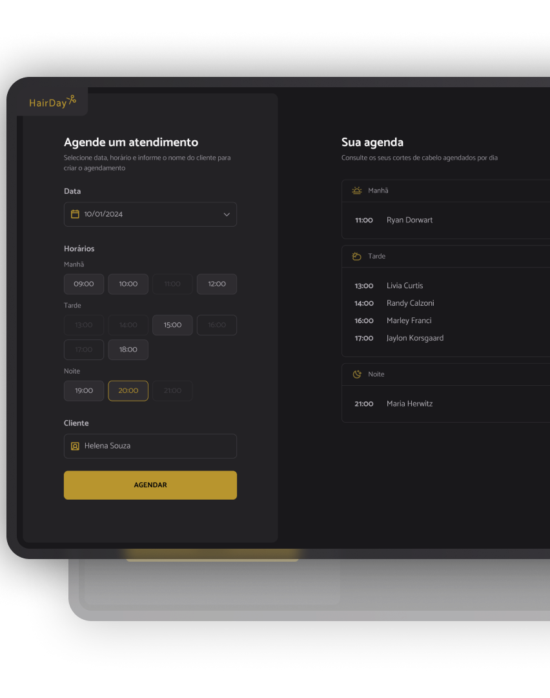

<h1 align="center">✂️ HairDay</h1>

<p align="center">
  Uma aplicação web para gerenciamento de agendamentos, desenvolvida com JavaScript, Webpack e consumo de API.
</p>

<p align="center">
  <a href="#-tecnologias">Tecnologias</a>
  &nbsp;&nbsp;&nbsp;|&nbsp;&nbsp;&nbsp;
  <a href="#-projeto">Projeto</a>
  &nbsp;&nbsp;&nbsp;|&nbsp;&nbsp;&nbsp;
  <a href="#-funcionalidades">Funcionalidades</a>
  &nbsp;&nbsp;&nbsp;|&nbsp;&nbsp;&nbsp;
  <a href="#-como-executar">Como executar</a>
  &nbsp;&nbsp;&nbsp;|&nbsp;&nbsp;&nbsp;
  <a href="#-aprendizados">Aprendizados</a>
</p>

<br>

<p align="center">
  
</p>

## 🚀 Tecnologias

Esse projeto foi desenvolvido utilizando:

- HTML
- CSS
- JavaScript
- Day.js
- JSON Server
- Webpack
- Babel
- Git e GitHub

## 💻 Projeto

O **HairDay** é uma aplicação de agendamento de horários desenvolvida durante a Formação Full Stack da Rocketseat.

O projeto permite visualizar os horários disponíveis de acordo com a data selecionada, realizar novos agendamentos e cancelar atendimentos já cadastrados.

Além da manipulação do DOM, o projeto trabalha com requisições assíncronas e comunicação com uma API utilizando `fetch`, permitindo persistir os dados através do JSON Server.

## ✨ Funcionalidades

- Seleção da data do atendimento
- Exibição dos horários disponíveis
- Bloqueio de horários que já passaram
- Bloqueio de horários que já possuem agendamento
- Cadastro do nome do cliente
- Criação de novos agendamentos
- Listagem dos agendamentos por período
  - Manhã
  - Tarde
  - Noite
- Cancelamento de agendamentos
- Atualização dos horários após criar ou cancelar um atendimento
- Persistência dos dados utilizando JSON Server

## 📡 API

A aplicação utiliza o **JSON Server** para simular uma API REST local.

Os principais métodos HTTP utilizados foram:

- `GET` — buscar os agendamentos
- `POST` — criar um novo agendamento
- `DELETE` — cancelar um agendamento

A API é executada localmente na porta:

```text
http://localhost:3333
```

E os agendamentos são acessados através da rota:

```text
/schedules
```

## ⚙️ Como executar

Clone o projeto:

```bash
git clone URL_DO_REPOSITORIO
```

Entre na pasta:

```bash
cd hairday
```

Instale as dependências:

```bash
npm install
```

Inicie a aplicação:

```bash
npm run dev
```

Em outro terminal, inicie a API:

```bash
npm run server
```

A aplicação estará disponível em:

```text
http://localhost:3000
```

E a API em:

```text
http://localhost:3333
```

## 🧠 Aprendizados

Durante o desenvolvimento desse projeto pude praticar e aprofundar conhecimentos em:

- Manipulação do DOM
- Eventos no JavaScript
- Modularização com ES Modules
- Funções assíncronas
- Promises
- `async` e `await`
- `try...catch`
- Requisições utilizando `fetch`
- Métodos HTTP
- Manipulação de JSON
- Arrays e seus métodos
- Manipulação de datas utilizando Day.js
- Consumo de API REST
- Gerenciamento de pacotes com npm
- Organização de código em módulos e serviços
- Configuração de ambiente com Webpack e Babel

## 📂 Estrutura do projeto

```text
hairday/
├── src/
│   ├── assets/
│   ├── libs/
│   ├── modules/
│   │   ├── form/
│   │   └── schedules/
│   ├── services/
│   ├── styles/
│   ├── utils/
│   └── main.js
│
├── index.html
├── server.json
├── webpack.config.js
├── package.json
└── package-lock.json
```

---

<p align="center">
  Desenvolvido por <strong>Victor Koithi</strong> 👨‍💻
</p>

<p align="center">
  <a href="https://github.com/vkoithi">GitHub</a>
  &nbsp;&nbsp;•&nbsp;&nbsp;
  <a href="https://www.linkedin.com/in/vkoithi">LinkedIn</a>
</p>